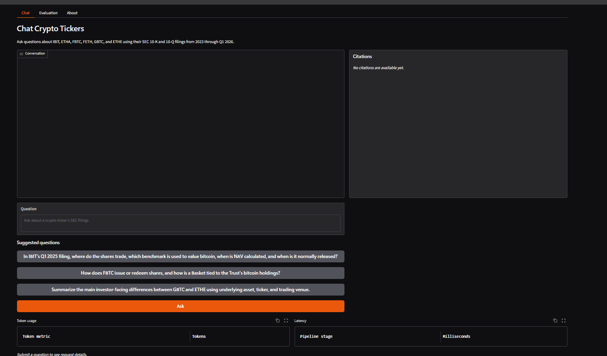
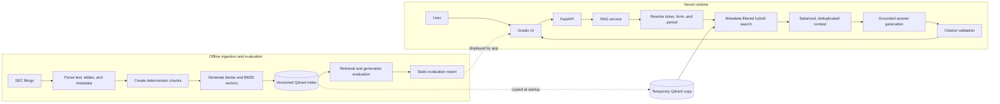
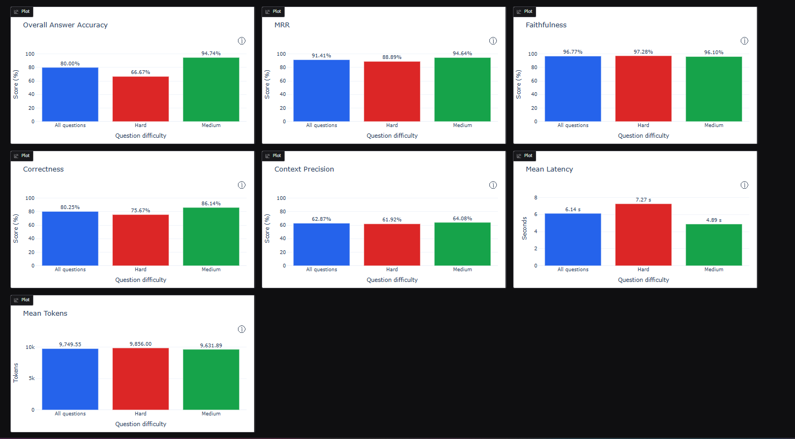
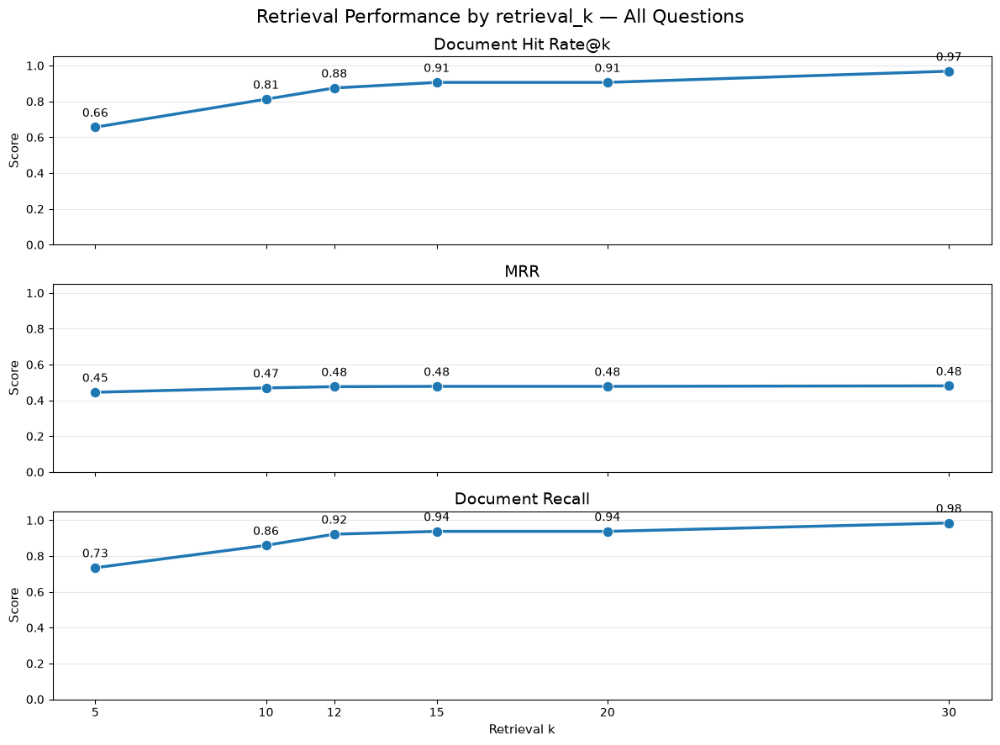
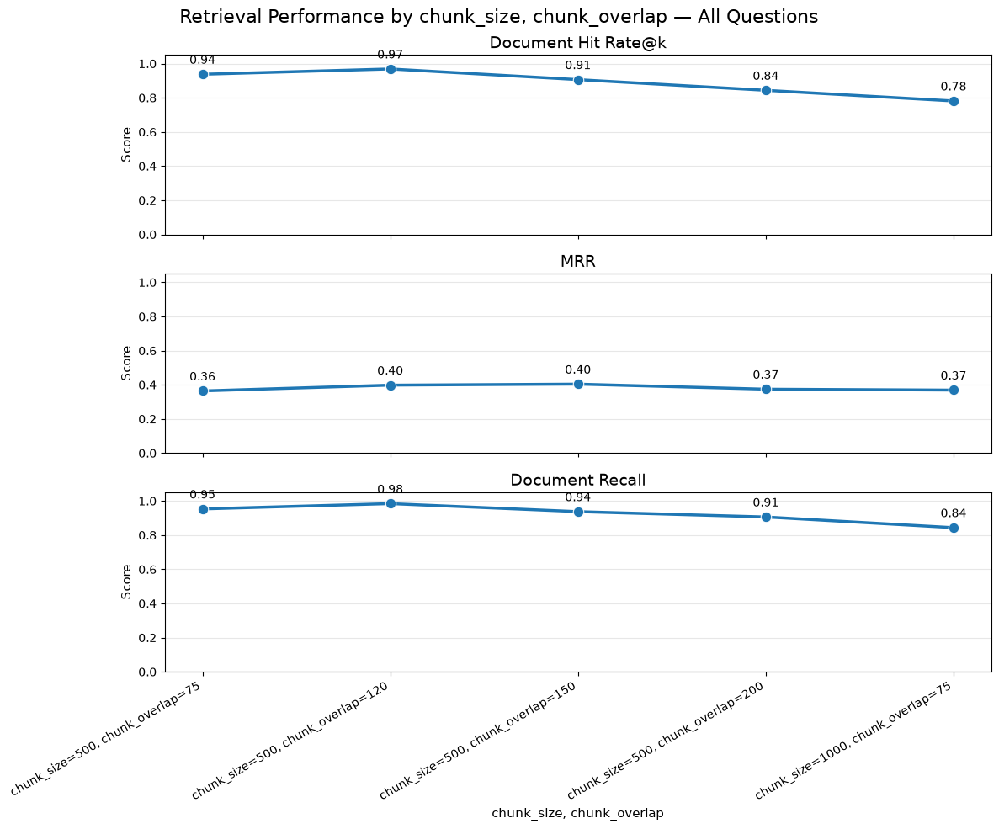
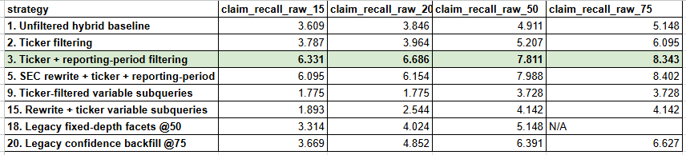
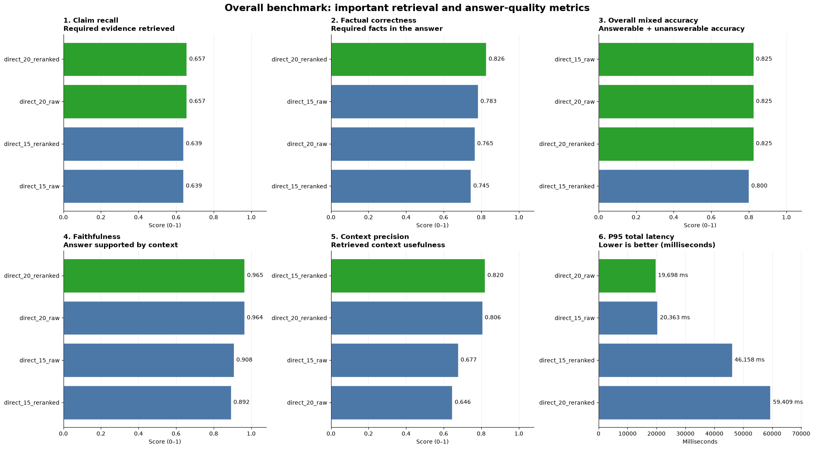

# Crypto SEC Filings Chat (RAG Project)

A production-oriented retrieval-augmented generation (RAG) system for researching cryptocurrency-exposed public companies through their SEC filings.

The application combines dense retrieval, BM25 sparse retrieval, metadata filtering, Reciprocal Rank Fusion (RRF), grounded answer generation, and source citations. It includes a FastAPI API, a Gradio interface, deterministic and model-based evaluation, and a containerized Vercel deployment.

> This project is an educational research tool. It does not provide financial or investment advice.

## Live application

- **Live demo:** [TODO: Add Vercel URL](https://example.vercel.app)
- **Repository:** [github.com/Botia13/crypto_chatbot_rag](https://github.com/Botia13/crypto_chatbot_rag)

## Project overview

Financial information about crypto-related investment products is often distributed across long, structurally complex SEC filings. A general-purpose language model may answer from outdated knowledge, omit important context, or generate unsupported statements.

This project addresses that problem with a RAG pipeline that:

1. Ingests public SEC filings.
2. Preserves filing and section metadata.
3. Splits filing content into retrieval-ready chunks.
4. Creates dense and BM25 sparse representations.
5. Retrieves evidence with metadata-filtered hybrid search.
6. Generates an answer using only the retrieved evidence.
7. Returns citations, source links, latency, token usage, and retrieval diagnostics.
8. Evaluates retrieval and generation separately.

## Architecture

## Supported corpus

The current corpus covers selected `10-K` and `10-Q` filings for:

| Ticker | Fund |
|---|---|
| IBIT | iShares Bitcoin Trust ETF |
| ETHA | iShares Ethereum Trust ETF |
| FBTC | Fidelity Wise Origin Bitcoin Fund |
| FETH | Fidelity Ethereum Fund |
| GBTC | Grayscale Bitcoin Trust ETF |
| ETHE | Grayscale Ethereum Trust ETF |

Every indexed chunk retains provenance metadata such as:

- Ticker
- Company or fund name
- Form type
- Filing date
- Reporting-period end
- SEC accession number
- Filing URL
- Section title and identifier
- Table metadata
- Chunk identifier
- Pipeline and embedding-input versions

The source documents are public SEC filings. The SEC remains the authoritative source.

## RAG pipeline

### 1. SEC filing ingestion

The ingestion pipeline downloads and parses SEC filings while preserving their document structure.

It extracts:

- Filing metadata
- Sections and item identifiers
- Text blocks
- Tables
- Reporting periods
- Source URLs and accession numbers

The pipeline retains table structure so financial labels, reporting periods, units, and values are not flattened into unrelated text.

### 2. Chunking

The selected production configuration uses:

| Parameter | Value |
|---|---:|
| Chunk size | 500 tokens |
| Chunk overlap | 120 tokens |
| Encoding | `cl100k_base` |
| Pipeline version | `v5` |

Chunk identifiers are deterministic, so the same source section produces stable point identifiers across repeatable ingestion runs.

### 3. Embeddings

Dense embeddings are generated with `openai/text-embedding-3-small`.

The embedding input includes document metadata alongside the chunk content. This helps retrieval distinguish similar passages from different funds, forms, and reporting periods.

### 4. Hybrid retrieval

Each question produces:

- One dense query vector
- One BM25 sparse query vector
- Metadata filters derived from the requested ticker, form type, and reporting period
- A fused candidate ranking using RRF

#### 4.1 Metadata filtering

Before retrieval, the system resolves natural-language constraints against the filing catalog. It always applies a ticker filter when the question identifies a supported ticker. When the question also identifies a form type or reporting period, the system resolves matching filings and filters on the exact `form_type` and `period_end` values.

The same filter is applied to both dense and sparse prefetches and to the final fused query. This prevents unrelated filings from consuming the candidate limit or entering the final context. Accession numbers remain part of each chunk's provenance and uniquely identify filings.

### 5. Multi-document retrieval

Comparison questions can require evidence from multiple funds or filings. The system:

1. Resolves each requested filing scope.
2. Runs a filtered search for each scope.
3. Reuses the same query embedding.
4. Interleaves results across scopes.
5. Deduplicates repeated chunks.
6. Preserves balanced evidence across the requested documents.

### 6. Grounded generation

The generation model receives:

- System instructions
- Limited conversation history
- Retrieved evidence
- Source identifiers

The prompt instructs the model to answer from the supplied evidence and cite supporting chunks using structured source markers.

### 7. Citation validation

After generation, the application extracts citation identifiers and verifies that every cited identifier belongs to the retrieved context.

Citation validation is deterministic. It does not prove that an answer is factually correct, but it detects references to missing or invented chunks.

## Production configuration

| Component | Selected value |
|---|---|
| Chunk size | `500` |
| Chunk overlap | `120` |
| Dense embedding | `openai/text-embedding-3-small` |
| Sparse representation | `Qdrant/bm25` |
| Fusion | Reciprocal Rank Fusion |
| Retrieved context count | `20` |
| Reranking | Disabled |
| Generation model | `openai/gpt-5.6-luna` |
| Temperature | `0` |

Reranking was evaluated but is disabled in the selected configuration. The rationale is explained below.

## Evaluation methodology

The evaluation separates retrieval performance from answer-generation performance.

### Deterministic metrics

These metrics do not require an evaluator model:

- Document hit rate at `k`
- Document recall at `k`
- Mean Reciprocal Rank
- Citation resolution
- Abstention behavior
- Retrieved-document scope validation
- Retrieval latency
- Generation latency
- Total latency
- Input and output token usage

### Model-evaluated metrics

These metrics use an evaluator model and should be interpreted as estimates:

- Answer correctness
- Faithfulness
- Factual correctness
- Context precision

Model-based metrics are reported separately because they can vary with the evaluator model, prompt, and threshold.

### Evaluation dataset

The evaluation dataset includes:

- Answerable questions
- Unanswerable questions
- Single-document questions
- Multi-document comparisons
- Table-oriented questions
- Factual questions
- Questions with explicit filing scopes
- Questions with missing or unsupported scopes

## Final results

The complete static evaluation summary is available in [`artifacts/evaluation/summary.json`](artifacts/evaluation/summary.json).

The hosted application displays this versioned report instead of rerunning the paid evaluation suite.

## Experiments and decisions

The project evaluated multiple combinations of:

- Chunk sizes
- Chunk overlaps
- Retrieval depths
- Dense-only and hybrid retrieval
- Metadata-aware embeddings
- Raw and reranked retrieval
- Prompt versions
- Generation models
- Single-document and multi-document strategies

The model-selection process was:

1. Establish a literature-informed baseline.
2. Select the strongest retrieval depth, chunk size, and chunk overlap.
3. Compare dense, BM25, and hybrid retrieval.
4. Compare subqueries, metadata pre-filtering, and query rewriting.
5. Measure whether reranking justifies its runtime cost.
6. Refine the generation prompt.

The experiment notebooks are in [`src/RAG_model/model_analysis_notebooks/`](src/RAG_model/model_analysis_notebooks/).

### Selected configuration

#### Retrieval parameters

Document hit rate, recall, and Mean Reciprocal Rank were used to select the retrieval parameters.

1. Retrieval depth (`k`):

   

2. Chunk size and overlap:

   

### Why hybrid retrieval?

Dense retrieval is useful for semantic similarity, while BM25 helps recover exact terminology, financial labels, tickers, and form-specific language. RRF combines both rankings without requiring their raw scores to be directly comparable.

### Why metadata filtering?

The experiments compared unfiltered retrieval, ticker filtering, ticker-and-period filtering, query rewriting, and subquery strategies. Ticker filtering provided the strongest general trade-off in the benchmark. In production, the resolver also applies exact form-type and reporting-period filters when the question provides those constraints.

Financial questions often identify a specific ticker, filing type, or reporting period. Applying these filters before retrieval prevents semantically similar passages from unrelated filings from entering the context.

### Why is reranking disabled?

Reranking produced only a small retrieval improvement while increasing cold-start time, runtime dependencies, memory consumption, and request latency. The non-reranked hybrid configuration therefore provided the better production trade-off for this portfolio deployment.

## Deployment architecture

The hosted demonstration uses an immutable Qdrant index packaged with the application.

When a Vercel instance starts:

1. The packaged index is copied to a unique temporary directory.
2. Embedded Qdrant opens the temporary copy.
3. The application performs read-only retrieval.
4. The temporary copy disappears when the instance is removed.

This design provides zero-cost vector storage for a small, fixed portfolio corpus.

It has deliberate limitations:

- The index is immutable at runtime.
- Every cold instance copies the index.
- Cold starts are slower than warm requests.
- Updating the corpus requires rebuilding and redeploying the index.
- A larger or frequently updated production system should use a managed, persistent vector database.

This is a deployment optimization for a portfolio demonstration, not a recommendation for a large, mutable production workload.

## Cost and security controls

The public application includes:

- Maximum question length
- Limited conversation history
- Maximum generation tokens
- Concurrency limits
- Provider timeouts
- Generic user-facing errors
- Citation validation
- Read-only vector storage

The OpenRouter key used by the deployment should:

- Be dedicated to this project
- Have a hard spending limit
- Have usage alerts
- Never appear in browser code, logs, Git history, or screenshots

## Known limitations

- The corpus is limited to selected filings and funds.
- The application does not contain all available SEC filings.
- The hosted index is immutable.
- Newly published filings are unavailable until the index is rebuilt and redeployed.
- A valid citation does not automatically prove that the generated interpretation is correct.
- Model-based evaluation metrics depend on the evaluator model and prompt.
- Financial tables remain challenging when relevant values are distributed across multiple rows or sections.
- Conversation history is limited and is not persisted.
- Cold starts are slower because the packaged index must be copied to temporary storage.
- The project does not provide financial advice.

## Future improvements

Potential improvements include:

- Incremental ingestion for new filings
- Managed, persistent Qdrant for mutable deployments
- Distributed rate limiting
- Streaming responses
- Improved table retrieval
- Query rewriting
- Reranking when its quality gain justifies the runtime cost
- Human feedback collection
- Evaluation monitoring across pipeline versions

## Disclaimer

This application is provided for educational and research purposes only.

It may produce incomplete, incorrect, or outdated information. It is not a substitute for reading the original SEC filing and does not constitute financial, legal, tax, or investment advice.

Always verify important information using the linked SEC source documents.

## License

This project is licensed under the MIT License. See the [`LICENSE`](LICENSE) file for details.
